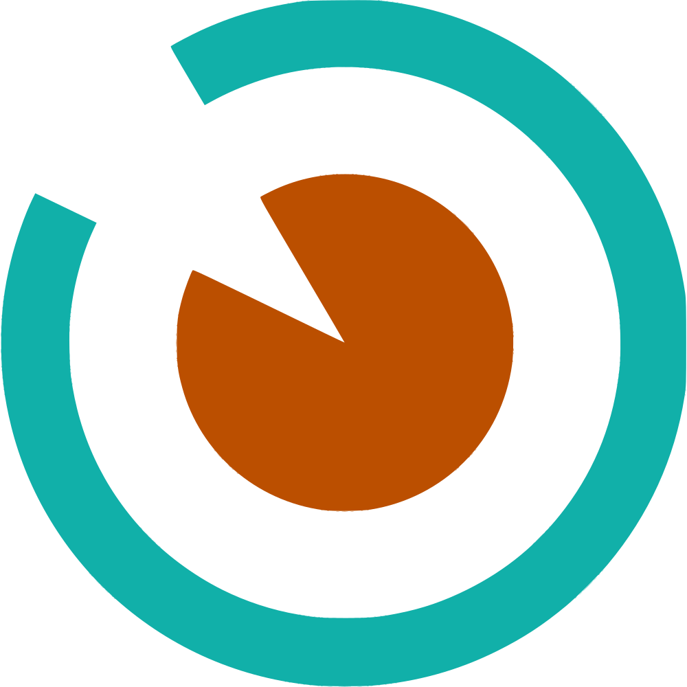

# DIRD+ — Plataforma de Detección de Retinopatía Diabética con IA Edge-Computing

<p align="center">
  
</p>

<p align="center">
  <strong>Análisis oftalmológico con inteligencia artificial ejecutada íntegramente en el navegador.</strong><br>
  Privacidad total. Sin dependencia de servidores. Sin costo por tamizaje.
</p>

> **Aviso importante**: DIRD+ es un sistema de investigación y desarrollo. No está aprobado como dispositivo médico. No debe usarse como único criterio diagnóstico en entornos clínicos reales.

[](LICENSE) [](https://tmeduca.org/dird/) [](https://github.com/Debaq/Dird/tree/w/tauri)

<p align="center">
  <a href="#el-problema">El Problema</a> · 
  <a href="#la-solución">La Solución</a> · 
  <a href="#diferenciadores">Diferenciadores</a> · 
  <a href="#comparativa-de-mercado">Mercado</a> · 
  <a href="#arquitectura-técnica">Arquitectura</a> · 
  <a href="#referencias-científicas">Referencias</a>
</p>

---

## Tabla de Contenidos

- [El Problema](#el-problema)
  - [Epidemiología Global](#epidemiología-global)
  - [Contexto Chile](#contexto-chile)
  - [La Brecha de Tamizaje](#la-brecha-de-tamizaje)
- [La Solución](#la-solución)
  - [Propuesta de Valor](#propuesta-de-valor)
  - [Flujo Clínico](#flujo-clínico)
  - [Motor de Guías Clínicas Pluggable](#motor-de-guías-clínicas-pluggable--funcionalidad-única)
- [Diferenciadores frente al Mercado](#diferenciadores-frente-al-mercado)
  - [Comparativa de Mercado](#comparativa-de-mercado)
  - [Por qué las Soluciones Existentes no han Cerrado la Brecha](#por-qué-las-soluciones-existentes-no-han-cerrado-la-brecha)
  - [Ventaja Regulatoria: Soberanía de Datos](#ventaja-regulatoria-soberanía-de-datos)
  - [Impacto Económico](#impacto-económico)
- [Arquitectura Técnica](#arquitectura-técnica)
  - [Diagrama de Arquitectura](#diagrama-de-arquitectura)
  - [Stack Tecnológico](#stack-tecnológico)
  - [Pipeline de Inferencia IA](#pipeline-de-inferencia-ia)
  - [Sistema de Guías Clínicas Pluggable](#sistema-de-guías-clínicas-pluggable)
  - [Esquema de Base de Datos](#esquema-de-base-de-datos)
  - [Estructura del Proyecto](#estructura-del-proyecto)
- [Funcionalidades](#funcionalidades)
- [Instalación y Despliegue](#instalación-y-despliegue)
- [Guías Clínicas Soportadas](#guías-clínicas-soportadas)
- [Hoja de Ruta](#hoja-de-ruta)
- [Referencias Científicas](#referencias-científicas)
- [Equipo y Afiliación](#equipo-y-afiliación)

---

## El Problema

### Epidemiología Global

La retinopatía diabética (RD) es la **principal causa de ceguera en adultos en edad laboral** (20-74 años) en países desarrollados (OMS, World Report on Vision, 2019). Más del **80% de esta ceguera es prevenible** con detección temprana y tratamiento oportuno.

| Indicador | Cifra | Fuente |
|-----------|-------|--------|
| Adultos con diabetes en el mundo | 537 millones (2021) | IDF Diabetes Atlas, 10ª ed. |
| Proyección para 2045 | 783 millones | IDF, 2021 |
| Prevalencia de RD entre diabéticos | 22-35% | Teo et al., *Ophthalmology*, 2021; Yau et al., *Diabetes Care*, 2012 |
| Personas con algún grado de RD | ~103 millones (2020) | Teo et al., 2021 |
| RD que amenaza la visión | 6-10% de diabéticos | Yau et al., 2012 |
| Casos de ceguera por RD | ~860,000 | GBD 2020, *Lancet Global Health* |
| Diabéticos sin diagnóstico | ~240 millones | IDF, 2021 |

Sin tratamiento, aproximadamente el **50% de los pacientes con RD proliferativa quedan legalmente ciegos en 5 años** (National Eye Institute, NIH).

### Contexto Chile

Chile enfrenta una situación particularmente crítica:

| Indicador | Cifra | Fuente |
|-----------|-------|--------|
| Prevalencia de diabetes en adultos | **12.3%** (~1.7 millones de personas) | Encuesta Nacional de Salud 2016-2017, MINSAL |
| Sospecha de diabetes (incl. no diagnosticados) | 15.8% | ENS 2016-2017 |
| Prevalencia en mayores de 65 años | >30% | ENS 2016-2017 |
| Diabéticos con algún grado de RD estimados | 425,000 - 595,000 | Programa de Salud Cardiovascular, MINSAL |
| Diabéticos que reciben tamizaje oftalmológico oportuno | **Solo 15-30%** | Programa de Salud Cardiovascular, MINSAL |
| Oftalmólogos en el país | ~1,100 - 1,300 | Sociedad Chilena de Oftalmología |
| Concentrados en Región Metropolitana | 60-65% | Superintendencia de Salud |
| Densidad en regiones extremas | <3 por 100,000 hab. | Registro de Prestadores, Superintendencia de Salud |

La Retinopatía Diabética está incluida en las **Garantías Explícitas en Salud (GES)** desde 2006, obligando al Estado a garantizar acceso a tamizaje y tratamiento. Sin embargo, las **listas de espera GES para oftalmología superan los plazos garantizados** en múltiples regiones, y la distribución inequitativa de especialistas deja a regiones como Aysén, Magallanes, Atacama y la Araucanía con cobertura insuficiente.

### La Brecha de Tamizaje

La OMS y la ADA recomiendan exámenes de fondo de ojo **al menos cada 1-2 años** para todo diabético. La realidad es otra:

| País/Región | Tasa de tamizaje oportuno | Fuente |
|-------------|--------------------------|--------|
| Países de altos ingresos | 50-70% | Piyasena et al., *PLoS ONE*, 2019 |
| Países de bajos/medianos ingresos | 10-30% | Piyasena et al., 2019 |
| Chile (APS pública) | 15-30% | MINSAL |

**Barreras principales:**
- **Escasez de especialistas**: Déficit mundial estimado de >200,000 oftalmólogos (Resnikoff et al., *BJO*, 2020)
- **Costo**: Examen con oftalmólogo: USD 50-200 en Latinoamérica
- **Acceso geográfico**: Concentración urbana de especialistas
- **Tiempos de espera**: 6-12 meses en sistema público chileno
- **Conectividad**: 40-60% de establecimientos rurales con internet limitado (ITU, 2022)

---

## La Solución

DIRD+ es una plataforma web que ejecuta modelos de visión artificial para detección de retinopatía diabética **íntegramente en el navegador** del usuario, mediante ONNX Runtime Web (WebAssembly). Las imágenes de fondo de ojo se procesan localmente — **los datos del paciente nunca abandonan el dispositivo**.

### Propuesta de Valor

| Aspecto | Qué ofrece DIRD+ | Por qué importa |
|---------|-------------------|-----------------|
| **Privacidad total** | Inferencia IA en el navegador. Cero transmisión de datos a servidores externos | Cumplimiento con Ley 21.096 y regulaciones de datos de salud sin esfuerzo adicional |
| **Costo cero de operación** | Sin licencias, sin pago por tamizaje, sin hardware propietario | Viable para CESFAM rurales con presupuesto limitado |
| **Funciona offline** | Modelos descargados una vez, almacenados en caché del navegador. IndexedDB local | Operativo en zonas sin conectividad estable |
| **Guías clínicas adaptables** | Sistema pluggable: ICDR 2024 (internacional), MINSAL Chile 2017. Agregar nuevas guías sin modificar código | Adaptable a protocolos locales GES sin depender de proveedor extranjero |
| **Código abierto** | Código fuente completo auditable. Algoritmos, umbrales y criterios verificables | Transparencia para reguladores, investigadores y clínicos |
| **Portabilidad** | Formato `.dird` (ZIP) para exportar/importar pacientes completos | Interoperabilidad entre instalaciones sin vendor lock-in |

### Flujo Clínico

```
1. CAPTURA             2. CARGA               3. ANÁLISIS IA          4. REVISIÓN
Retinógrafo         →  Subir imágenes      →  Detección automática →  Canvas interactivo
(cualquier cámara)     al navegador            de lesiones (ONNX)     multicapa con
                       OD / OI                 + Segmentación         herramientas de
                                                                      anotación

5. CLASIFICACIÓN       6. INFORME             7. EXPORTACIÓN
Severidad según     →  PDF configurable    →  Formato .dird
guía clínica           con conclusiones       portable entre
(ICDR/MINSAL)          y recomendaciones      instalaciones
```

**Todo ocurre en el navegador. Sin servidor. Sin internet (después de la primera carga).**

### Motor de Guías Clínicas Pluggable — Funcionalidad Única

DIRD+ incluye un **motor de clasificación clínica agnóstico a la guía**, una capacidad que ningún otro sistema de tamizaje de RD ofrece. Mientras todos los competidores (DART, IDx-DR, EyeArt, Google ARDA) implementan un criterio de clasificación fijo y cerrado — generalmente un resultado binario "referir / no referir" — DIRD+ permite que **cualquier guía clínica sea cargada como un archivo JSON sin modificar código**.

#### Por qué es potente

| Capacidad | Impacto |
|-----------|---------|
| **Guías como datos, no como código** | Agregar la guía de un nuevo país es crear un JSON y registrarlo. Sin desarrollo, sin esperar al proveedor |
| **Clasificación detallada por severidad** | No solo "referir/no referir": DIRD+ clasifica en 5+ niveles (sin RD → leve → moderada → severa → proliferativa), con tratamientos, urgencia y plazo de seguimiento específicos por nivel |
| **Análisis espacial por cuadrante** | Distribución de lesiones en 4 cuadrantes + centro macular. Evalúa la Regla 4-2-1 (criterio ICDR para RDNP severa) automáticamente |
| **Múltiples guías simultáneas** | Clasificar la misma imagen según ICDR (internacional) y MINSAL (Chile) para comparar criterios. Útil en investigación y docencia |
| **Protocolos de tratamiento integrados** | Cada nivel de severidad define acciones clínicas, urgencia (rutina/acelerada/urgente) e intervalo de seguimiento en días |
| **Mapeo de clases IA → clínica** | Traduce las detecciones del modelo (microaneurysm, hemorrhage, cotton_wool_spot...) a categorías clínicas de la guía (microaneurismas, hemorragias, exudados...) |
| **Corrección humana preservada** | El clínico puede modificar la clasificación generada. El sistema marca `manuallyModified: true` para trazabilidad |
| **Validación automática** | Al cargar una guía, el sistema valida estructura, coherencia de niveles, reglas y protocolos. Reporta errores y advertencias |

#### Guías actualmente implementadas

| Guía | Origen | Uso |
|------|--------|-----|
| **ICDR 2024** | International Council of Ophthalmology | Estándar internacional de referencia |
| **MINSAL Chile 2017** | Ministerio de Salud de Chile | Protocolo GES nacional chileno |

#### Ejemplo de extensión

Para agregar la guía de cualquier otro país (ej. México, Colombia, España):

1. Crear `public/clinical-guidelines/mi_guia.json` con niveles de severidad, reglas de clasificación, protocolos de tratamiento y mapeo de clases
2. Registrar en `public/clinical-guidelines/index.json`
3. La aplicación la detecta automáticamente al recargar

No requiere conocimiento de programación — solo conocimiento clínico para definir los criterios.

#### Implicancia estratégica

Este diseño convierte a DIRD+ en una **plataforma**, no solo una herramienta. Cada país, servicio de salud o grupo de investigación puede adaptar la clasificación a sus protocolos locales sin depender del desarrollador. Esto es especialmente relevante para:

- **Escalamiento regional**: Una misma plataforma sirve para Chile (MINSAL), Perú, Colombia, México — cada uno con su guía
- **Investigación**: Comparar cómo diferentes guías clasifican los mismos hallazgos
- **Docencia**: Enseñar a residentes las diferencias entre criterios internacionales y locales
- **Evolución clínica**: Cuando una guía se actualiza, basta actualizar el JSON — sin esperar una nueva versión del software

#### Separación de Roles: Guía Clínica vs. LLM Externo

Un principio de diseño fundamental de DIRD+ es la **separación estricta entre clasificación clínica y generación de texto narrativo**:

```
┌──────────────────────────────────────────────────────────────────────┐
│                    CLASIFICACIÓN (local, determinista)               │
│                                                                      │
│  Detecciones IA → Motor de Guía Clínica → Severidad + Tratamiento   │
│  (ONNX local)     (JSON pluggable)         + Urgencia + Seguimiento │
│                                                                      │
│  La GUÍA CLÍNICA decide. Reglas explícitas, auditables,             │
│  reproducibles. Sin IA generativa. Sin caja negra.                  │
└──────────────────────────┬───────────────────────────────────────────┘
                           │
                           ▼ datos estructurados ya clasificados
┌──────────────────────────────────────────────────────────────────────┐
│                    NARRACIÓN (remota, opcional)                       │
│                                                                      │
│  Datos de clasificación → LLM externo → Texto de conclusión clínica │
│  (severidad, lesiones,    (vía backend)   narrativo para el informe  │
│   tratamientos, urgencia)                                            │
│                                                                      │
│  El LLM NARRA. Recibe la decisión ya tomada por la guía y la        │
│  redacta como texto clínico legible. No clasifica. No diagnostica.  │
│  El clínico puede editar el texto antes de finalizar el informe.    │
└──────────────────────────────────────────────────────────────────────┘
```

**¿Por qué esta separación importa?**

| Aspecto | Sin separación (otros sistemas) | DIRD+ |
|---------|--------------------------------|-------|
| **Trazabilidad** | "La IA dijo esto" — ¿qué IA? ¿qué criterio? | Clasificación trazable a reglas explícitas de la guía. El JSON es auditable |
| **Reproducibilidad** | Misma imagen → diferentes resultados según el prompt | Misma imagen + misma guía = mismo resultado, siempre |
| **Regulación** | Difícil demostrar que el LLM no alucina un diagnóstico | La clasificación no depende de IA generativa. El LLM solo redacta |
| **Offline** | Si el LLM no está disponible, no hay conclusión | Sin LLM: la clasificación completa funciona igual. Solo falta el texto narrativo |
| **Sesgo** | El LLM puede introducir sesgos en la clasificación | El LLM no tiene influencia sobre la severidad ni el tratamiento |
| **Edición humana** | ¿El clínico edita la clasificación o el texto? | Clasificación y texto editables por separado. `manuallyModified` preserva trazabilidad |

El LLM externo es un **servicio opcional de redacción**. DIRD+ funciona completamente sin él — la clasificación, severidad, tratamientos, urgencia y seguimiento se determinan localmente por la guía clínica.

---

## Diferenciadores frente al Mercado

### Comparativa de Mercado

| Característica | DART (TeleDx, Chile) | IDx-DR (Digital Diagnostics) | Google ARDA | EyeArt (Eyenuk) | Phelcom Eyer (Brasil) | **DIRD+** |
|---|---|---|---|---|---|---|
| **Procesamiento** | Cloud | Cloud | Cloud | Cloud | Cloud | **Edge (navegador)** |
| **Datos salen del dispositivo** | Sí (cloud TeleDx) | Sí (USA) | Sí (Google Cloud) | Sí (USA) | Sí (Brasil) | **No** |
| **Funciona offline** | No | No | No | No | No | **Sí** |
| **Hardware requerido** | Retinógrafo + internet | Topcon NW400 (~USD 15-25K) | Cámara de mesa (~USD 5-15K) | Cámara compatible (~USD 5-15K) | Smartphone + adaptador (~USD 3-5K) | **Cualquier cámara existente** |
| **Costo por tamizaje** | Licencia por volumen (MINSAL) | ~USD 40-55 | No disponible comercialmente | ~USD 8-15 | Suscripción | **USD 0** |
| **Código abierto** | No | No | Parcial (papers) | No | No | **Sí** |
| **Idioma español nativo** | Sí | No | No | No | Portugués/Inglés | **Sí** |
| **Multi-guía clínica** | No | No (resultado binario) | No | No | No | **Sí (ICDR, MINSAL, extensible)** |
| **Clasificación detallada** | Riesgo (sí/no) | Binario (referir/no) | 5 niveles | Referir/no | Referir/no | **5+ niveles por guía, con cuadrantes** |
| **Canvas de revisión/anotación** | No | No | No | No | No | **Sí (multicapa, mediciones)** |
| **Aprobación regulatoria** | Validación clínica publicada (*Eye*) | FDA De Novo, CE | CE, Thai FDA | FDA 510(k), CE | ANVISA | En desarrollo |
| **Soberanía de datos** | Parcial (cloud en Chile) | No (USA) | No (Google) | No (USA) | No (Brasil) | **Sí (100% local)** |
| **Despliegue en Chile** | 170 establecimientos, >350K exámenes | No | No | No | No | En desarrollo |

**No existe otra plataforma que combine edge-computing en navegador + funcionamiento offline + código abierto + soporte multi-guía clínica para tamizaje de RD.**

### DART: El Referente Chileno y Cómo DIRD+ lo Complementa

**DART** (TeleDx) es la plataforma de tamizaje de RD con IA desplegada por el MINSAL en Chile. Es el sistema más maduro en el país:

- **Cobertura**: 170+ establecimientos públicos, >350,000 exámenes analizados
- **Rendimiento**: Sensibilidad 94.6%, especificidad 74.3% (validación publicada en *Eye*)
- **Modelo**: Cloud — imágenes se suben a la plataforma para análisis IA + teleinformes por oftalmólogos remotos
- **Adquisición MINSAL**: Licencia por 200,000 casos (2018)
- **Impacto**: Reduce necesidad de revisión por oftalmólogo en 50%, aumenta capacidad de atención 2-4x

**DART demostró que el tamizaje con IA funciona en Chile.** Sin embargo, su arquitectura cloud presenta limitaciones que DIRD+ aborda:

| Aspecto | DART | DIRD+ |
|---------|------|-------|
| **Conectividad** | Requiere internet para cada examen | Funciona offline |
| **Privacidad** | Imágenes se transmiten al cloud | Procesamiento 100% local |
| **Resultado** | Clasificación de riesgo (sí/no) | Severidad detallada por cuadrante según guía clínica |
| **Revisión de hallazgos** | No tiene canvas de anotación | Canvas multicapa con herramientas de medición |
| **Código** | Propietario (TeleDx) | Open source auditable |
| **Costo** | Licencia por volumen | Gratuito |
| **Dependencia** | Depende de TeleDx como proveedor | Sin vendor lock-in |

**DIRD+ no busca reemplazar DART sino complementarlo**: DART cubre la red pública con teleinformes centralizados; DIRD+ habilita tamizaje en establecimientos sin conectividad, proporciona herramientas de análisis detallado para el clínico, y ofrece una alternativa open source sin dependencia de proveedor.

### Por qué las Soluciones Existentes no han Cerrado la Brecha

Las soluciones comerciales de IA para RD existen desde 2018 (IDx-DR fue la primera con aprobación FDA). Sin embargo, la brecha de tamizaje persiste, especialmente en países de ingresos medios como Chile:

| Barrera | Cómo afecta | Cómo DIRD+ la resuelve |
|---------|-------------|------------------------|
| **Dependencia de internet** | 95%+ de las soluciones requieren cloud. Las zonas rurales donde más se necesita screening son las de peor conectividad. Caso documentado: Google ARDA en Tailandia falló en clínicas rurales por problemas de red (Beede et al., *CHI*, 2020) | Funciona 100% offline tras primera carga |
| **Costo por tamizaje** | USD 8-55 por screening se acumula. Para 1.7M de diabéticos chilenos: USD 13-93 millones/año solo en licencias de software | USD 0 por tamizaje |
| **Hardware propietario** | IDx-DR exige cámara Topcon NW400 (~USD 25K). Crea vendor lock-in | Compatible con cualquier imagen de fondo de ojo |
| **Idioma** | Mayoría de soluciones solo en inglés. Personal de APS chilena no domina inglés técnico | Interfaz y reportes en español nativo |
| **Soberanía de datos** | Imágenes retinales (datos biométricos) enviadas a servidores en EE.UU., China o Singapur | Datos nunca abandonan el dispositivo |
| **Adaptabilidad clínica** | Resultado binario (referir/no referir) sin adaptación a protocolos locales | Multi-guía: clasificación según MINSAL Chile, ICDR, o guías personalizadas |
| **Vendor lock-in** | Si el proveedor sube precios o desaparece, el hospital pierde capacidad de screening | Open source. Datos exportables en formato abierto |

### Ventaja Regulatoria: Soberanía de Datos

La arquitectura edge-computing de DIRD+ otorga una ventaja regulatoria estructural que los competidores cloud no pueden replicar fácilmente:

- **Chile — Ley 21.096**: Consagra la protección de datos personales como derecho constitucional. Los datos biométricos (imágenes retinales) son categoría especial.
- **Chile — Ley 21.719** (2024): Nuevo marco de protección de datos personales con requisitos más estrictos para datos de salud, alineado con GDPR europeo.
- **GDPR (Europa)**: Clasifica datos de salud como "categoría especial" con restricciones de transferencia transfronteriza (Art. 9, 44-49).
- **Tendencia global**: Múltiples países adoptan legislación de soberanía de datos que exige procesamiento local de datos de salud (Vayena & Blasimme, *JLME*, 2018).

DIRD+ cumple con todas estas regulaciones **por diseño**: no hay datos que proteger en tránsito porque nunca salen del dispositivo.

### Impacto Económico

Proyección comparativa para tamizaje a escala nacional en Chile (~1.7 millones de diabéticos):

| Solución | Costo software/año | Hardware inicial | Total Año 1 |
|----------|--------------------|--------------------|-------------|
| IDx-DR | ~USD 68-93M | ~USD 25K × N cámaras | >USD 70M |
| EyeArt | ~USD 13-25M | ~USD 10K × N cámaras | >USD 15M |
| **DIRD+** | **USD 0** | **Usa cámaras existentes** | **~USD 0** |

Estudios de costo-efectividad respaldan el tamizaje con IA:
- Reducción del **40-60%** en costos vs. evaluación manual por graders (Tufail et al., *Ophthalmology*, 2017)
- Costo por tamizaje con IA: **USD 2-15** vs. USD 50-200 con oftalmólogo presencial (Xie et al., *Lancet Digital Health*, 2020)
- En Inglaterra, el programa nacional de tamizaje (ENSPDR) logró que la RD **dejara de ser la primera causa de ceguera** en edad laboral por primera vez en 2010 (Liew et al., *BMJ Open*, 2014)

---

## Arquitectura Técnica

### Diagrama de Arquitectura

```
┌─────────────────────────────────────────────────────────────────┐
│                        NAVEGADOR WEB                            │
│                                                                 │
│  ┌────────────────┐  ┌───────────────────┐  ┌───────────────┐  │
│  │   React 18     │  │  ONNX Runtime Web │  │  IndexedDB    │  │
│  │   TypeScript   │  │  (WebAssembly)    │  │  (Dexie v4)   │  │
│  │                │  │                   │  │               │  │
│  │  ┌──────────┐  │  │  Modelos ONNX:    │  │  9 tablas:    │  │
│  │  │ Canvas   │  │  │  - Detección      │  │  - patients   │  │
│  │  │ Konva    │◄─┼──┤  - Segmentación   │  │  - sessions   │  │
│  │  │ multicapa│  │  │                   │  │  - images     │  │
│  │  └──────────┘  │  │  Análisis:        │  │  - detections │  │
│  │                │  │  - Clasificador DR │  │  - segments   │  │
│  │  ┌──────────┐  │  │  - Cuadrantes     │  │  - reports    │  │
│  │  │ PDF      │  │  │  - Edema macular  │  │  - measures   │  │
│  │  │ jsPDF    │  │  │  - Copa/disco     │  │  - classif.   │  │
│  │  └──────────┘  │  │                   │  │  - contrib.   │  │
│  │                │  │  OpenCV.js (CDN)   │  │               │  │
│  │  ┌──────────┐  │  │  Refinam. disco   │  │  16 versiones │  │
│  │  │ Guías    │  │  │  óptico           │  │  de migración │  │
│  │  │ Clínicas │  │  │                   │  │               │  │
│  │  │ ICDR     │  │  │  Optimizaciones:  │  │  Export:      │  │
│  │  │ MINSAL   │  │  │  - SIMD           │  │  .dird (ZIP)  │  │
│  │  └──────────┘  │  │  - Multi-thread   │  │               │  │
│  └────────────────┘  │  - CPU profiles   │  └───────────────┘  │
│                      │    (Intel/AMD/ARM) │                     │
│                      └───────────────────┘                     │
│                                                                 │
│         Toda la inferencia IA ocurre aquí ▲                     │
└─────────────────────────────────────────────────────────────────┘
                         │ (opcional)
                         ▼
              ┌─────────────────────┐
              │  Backend PHP        │
              │  - Gestión tokens   │
              │  - Contribuciones   │
              │  - Administración   │
              │  - Mensajería       │
              └─────────────────────┘
```

### Stack Tecnológico

#### Frontend
| Tecnología | Versión | Rol |
|-----------|---------|-----|
| React | 18.3 | Framework UI |
| TypeScript | 5.7 | Tipado estático (strict mode) |
| Vite | 6.0 | Build tool + HMR dev server |
| Tailwind CSS | 3.4 | Sistema de estilos utilitarios |
| Radix UI | — | Primitivas accesibles (Dialog, Tabs, Select, Switch, Slider) |
| React Router | 6 | Navegación SPA |
| Zustand | 5.0 | Estado global (configuración, canvas, tokens, pacientes) |
| Framer Motion | 11 | Animaciones y transiciones |
| i18next | 24.2 | Internacionalización (español/inglés) |

#### IA e Inferencia
| Tecnología | Versión | Rol |
|-----------|---------|-----|
| ONNX Runtime Web | 1.23 | Motor de inferencia WebAssembly |
| Modelos ONNX | — | Detección (bounding boxes) + Segmentación (máscaras de píxeles) |
| OpenCV.js | — | Refinamiento del disco óptico (CDN) |

#### Canvas y Visualización
| Tecnología | Versión | Rol |
|-----------|---------|-----|
| Konva | 10 | Motor canvas 2D de alto rendimiento |
| React-Konva | 18.2 | Bindings declarativos React-Konva |

#### Almacenamiento
| Tecnología | Versión | Rol |
|-----------|---------|-----|
| Dexie | 4.0 | Wrapper IndexedDB con 16 migraciones versionadas |
| JSZip | 3.10 | Formato `.dird` (ZIP portable con datos de paciente) |

#### Informes
| Tecnología | Versión | Rol |
|-----------|---------|-----|
| jsPDF | 2.5 | Generación de PDF en cliente |
| jspdf-autotable | 3.8 | Tablas clínicas en PDF |

### Pipeline de Inferencia IA

El procesamiento de imágenes sigue un pipeline de 6 etapas ejecutado completamente en WebAssembly:

```
Imagen retinal (cualquier cámara)
    │
    ▼
1. PREPROCESAMIENTO
   Redimensionar a 640×640, normalizar valores de píxeles
    │
    ▼
2. INFERENCIA ONNX
   Modelo de detección → bounding boxes con clase y confianza
   Modelo de segmentación → máscaras de píxeles por lesión
   (Optimizado: SIMD habilitado, perfiles CPU Intel/AMD/ARM)
    │
    ▼
3. POST-PROCESAMIENTO
   Non-Maximum Suppression (IoU threshold: 0.45)
   Filtrado por umbral de confianza configurable
    │
    ▼
4. ANÁLISIS ESPACIAL
   Distribución por cuadrantes (4 zonas + centro)
   Detección de edema macular (patrón de exudados)
   Análisis de microaneurismas, hemorragias
   Relación copa/disco óptico (con OpenCV.js)
   Calibración espacial desde disco óptico
    │
    ▼
5. CLASIFICACIÓN CLÍNICA
   Aplicar guía seleccionada (ICDR 2024 / MINSAL 2017)
   Mapear lesiones detectadas → criterios de la guía
   Evaluar Regla 4-2-1 para RD severa
   Generar: severidad, tratamientos, seguimiento, urgencia
    │
    ▼
6. ALMACENAMIENTO
   Guardar en IndexedDB: detecciones, segmentaciones,
   clasificación, mediciones
```

**Clases detectables:**
Microaneurismas, hemorragias (dot/blot), exudados duros, exudados blandos (cotton wool spots), neovascularización, disco óptico, fóvea.

**Niveles de severidad (ICDR 2024):**
Sin RD → RDNP leve → RDNP moderada → RDNP severa → RD proliferativa

### Sistema de Guías Clínicas Pluggable

DIRD+ implementa un motor de clasificación agnóstico a la guía clínica. Las guías son archivos JSON independientes que definen:

```json
{
  "guideline_id": "icdr_2024",
  "metadata": {
    "name": "ICDR International 2024",
    "country": "International",
    "language": "en",
    "status": "official"
  },
  "severity_levels": [
    {
      "id": "no_dr",
      "name_es": "Sin RD Aparente",
      "order": 0,
      "color": "#22c55e"
    },
    {
      "id": "mild_npdr",
      "name_es": "RDNP Leve",
      "order": 1,
      "color": "#84cc16"
    }
  ],
  "classification_rules": [
    {
      "severity": "mild_npdr",
      "conditions": ["microaneurysms_only"],
      "logic": "AND",
      "priority": 1
    }
  ],
  "rule_421": {
    "enabled": true,
    "criteria": [
      "extensive_hemorrhages_4q",
      "venous_beading_2q",
      "irma_1q"
    ]
  },
  "treatment_protocols": [
    {
      "severity": "severe_npdr",
      "urgency": "accelerated",
      "actions": ["referral_ophthalmology", "retinal_imaging"],
      "followup_interval_days": 30
    }
  ],
  "class_mapping": {
    "microaneurysms": ["microaneurysm", "microhemorrhages"],
    "hemorrhages": ["hemorrhage"],
    "hardExudates": ["hard_exudate"],
    "softExudates": ["cotton_wool_spot"],
    "neovascularization": ["neovascularization"]
  }
}
```

**Para agregar una nueva guía clínica:**
1. Crear archivo JSON en `public/clinical-guidelines/` siguiendo el esquema
2. Registrar en `public/clinical-guidelines/index.json`
3. La aplicación la detectará automáticamente — sin modificar código fuente

### Esquema de Base de Datos

IndexedDB local con 9 tablas y 16 versiones de migración:

| Tabla | Campos clave | Propósito |
|-------|-------------|-----------|
| **patients** | patientId, name, diabetes (tipo/duración), HTA, DLP, medicamentos | Datos demográficos y clínicos |
| **sessions** | patientId, date, modelVersions, locked, type (normal/combined) | Visitas clínicas |
| **images** | sessionId, eyeType (OD/OI), originalBlob, order | Imágenes de fondo de ojo |
| **detections** | imageId, type (ai/manual), bbox, class, confidence | Bounding boxes de lesiones |
| **segmentations** | imageId, type (ai/manual), maskData, class, opacity | Máscaras de segmentación |
| **imageClassifications** | imageId, severity, guideline, treatments[], followupDays, urgency, rationale, manuallyModified | Clasificación DR por guía clínica |
| **reports** | sessionId, type (preview/final), pdfBlob, evaluatorNotes, conclusionEdited | Informes PDF generados |
| **measurements** | imageId, origin, destination, distancePixels, distanceDD | Mediciones calibradas |
| **pendingContributions** | type (image/conclusion), referenceId, status | Contribuciones al dataset compartido |

### Estructura del Proyecto

```
src/
├── components/
│   ├── canvas/               # Canvas de anotación multicapa (Konva)
│   │   └── advanced-editor/  # Editor avanzado con herramientas especializadas
│   ├── patients/             # Gestión de pacientes, export/import
│   ├── upload/               # Carga de imágenes, galería, vista de sesión
│   ├── reports/              # Generación de informes PDF
│   ├── settings/             # Configuración (modelos, procesamiento, apariencia)
│   ├── admin/                # Panel de administración protegido
│   ├── contribution/         # Contribución de datos al dataset compartido
│   ├── academy/              # Contenido educativo
│   ├── demo/                 # Paciente demo y pantalla de carga
│   └── ui/                   # Primitivas UI reutilizables (Radix + Tailwind)
├── lib/
│   ├── ai/                   # InferenceService, ONNXModelManager, ModelDownloader
│   ├── analysis/             # ImageDRClassifier, QuadrantCalculator, EdemaDetector,
│   │                         # HemorrhageDetector, MicroaneurysmDetector,
│   │                         # OpticDiscCuppingDetector, SpatialCalibrator
│   ├── clinical-guidelines/  # GuidelineLoader, MultiGuidelineClassifier
│   ├── db/                   # Esquema Dexie, migraciones, paciente demo
│   ├── export/               # DirdExporter, DirdImporter (formato .dird ZIP)
│   ├── pdf/                  # Motor de renderizado de informes PDF
│   ├── classes/              # ClassManager (metadatos de clases del modelo)
│   └── api/                  # TokenService, AdminService
├── stores/                   # Estado global Zustand
│   ├── config-store.ts       # Configuración persistida (modelos, reportes, apariencia)
│   ├── canvas-store.ts       # Estado del canvas (herramienta, clase, undo/redo)
│   ├── token-store.ts        # Tokens disponibles para informes
│   └── patient-store.ts      # Paciente actual seleccionado
├── i18n/                     # Internacionalización (español/inglés)
├── hooks/                    # Custom hooks (useImageUploader, useMessagePolling)
├── types/                    # Interfaces TypeScript
└── App.tsx                   # Router principal + inicialización paralela
```

---

## Funcionalidades

### Gestión de Pacientes y Sesiones
- Crear, editar, archivar y buscar pacientes por nombre o ID
- Datos clínicos: diabetes (tipo, duración), HTA, dislipidemia, medicamentos
- Sesiones como visitas clínicas: duplicar, editar, cerrar
- Paciente demo precargado para evaluación del sistema
- Sesiones combinadas para análisis longitudinal

### Análisis con IA en el Navegador
- **Modelos duales**: Detección (bounding boxes) + Segmentación (máscaras de píxeles)
- **Ejecución local**: ONNX Runtime Web con SIMD y multi-thread
- **Descarga progresiva**: Modelos desde GitHub Releases, cacheados en navegador
- **Sensibilidad configurable**: Umbral de confianza ajustable por modelo
- **Optimización por CPU**: Perfiles para Intel, AMD y ARM
- **Procesamiento batch**: Todas las imágenes de una sesión en una ejecución

### Canvas Interactivo de Anotación
- **5 capas**: Imagen original, detecciones IA, segmentaciones IA, anotaciones manuales, mediciones
- **Herramientas**: Selección, dibujo libre, polígono, medición (distancia/área), zoom, pan
- **Controles por capa**: Visibilidad, opacidad, bloqueo
- **Overlays clínicos**: Cuadrantes retinales, zona macular, área del disco óptico
- **Corrección humana**: Modificar, ocultar o agregar detecciones sobre los resultados IA

### Clasificación Clínica Multi-Guía
- Clasificación de severidad según guía clínica seleccionada
- Análisis por cuadrante (4 zonas + centro) con distribución de lesiones
- Detectores especializados: hemorragias, microaneurismas, edema macular, copa/disco
- Evaluación de Regla 4-2-1 para RD severa
- Resultado: severidad, tratamientos, plazo de seguimiento, nivel de urgencia, rationale
- El clínico puede ajustar manualmente la clasificación generada

### Generación de Informes PDF
- **Preview**: Borrador sin consumir token. **Final**: Informe definitivo
- Secciones configurables: datos del paciente, galería, estadísticas, conclusión
- Galería personalizable: imágenes originales/anotadas, con/sin cuadrantes y mediciones
- Notas del evaluador, firma del profesional, edición de conclusión
- Campos del paciente ocultables (nombre, edad, ID) para privacidad

### Comparación de Sesiones
- Comparar estadísticas entre 2+ sesiones del mismo paciente
- Conteo de detecciones, severidad, análisis de tendencia temporal
- Sesiones combinadas con trazabilidad de origen

### Exportación e Importación
- **Formato `.dird`**: ZIP con datos completos (paciente, sesiones, imágenes, detecciones, informes)
- **3 niveles de exportación**: Paciente completo, sesión individual, datos totales
- **Mapeo de IDs**: IDs se reasignan al importar, evitando conflictos
- **Detección de colisiones**: Solicita confirmación antes de sobrescribir sesiones existentes

### Sistema de Contribución
- Subir imágenes y clasificaciones al dataset compartido
- Seguimiento de contribuciones pendientes y enviadas
- Mejora colaborativa de modelos

### Panel de Administración
- Gestión de tokens por instalación
- Visualización de contribuciones recibidas
- Sistema de mensajería broadcast a instalaciones
- Monitoreo de beacons (instalaciones activas)

### Módulo Academy

Sección educativa consultiva integrada en la aplicación, orientada a que el profesional de salud comprenda qué detecta la IA, cómo clasifica y qué guía clínica aplica:

- **Escalas de clasificación de RD**: Tres tabs comparativas con ICDR (internacional), MINSAL 2017 (Chile/GES) y ETDRS (investigación), con niveles de severidad, conducta clínica y links a guías oficiales
- **Clases detectables**: Catálogo visual de lesiones que el modelo detecta actualmente (microaneurismas, hemorragias, exudados duros/blandos, neovascularización) y clases en desarrollo (IRMA, arrosariamiento venoso, edema macular)
- **Cómo funciona DIRD**: Explicación del flujo de trabajo y la arquitectura de privacidad
- **Documentación técnica**: Acceso directo a revisión técnica del clasificador, roadmap de entrenamiento, mejoras sin reentrenar modelos, y guía clínica MINSAL 2017 (PDF original)
- **Disclaimer clínico**: Aviso de que es herramienta de apoyo, no reemplazo del criterio profesional
- **Tutorial interactivo**: Preparado para guía paso a paso (próximamente)

---

## Instalación y Despliegue

### Desarrollo Local

```bash
# Clonar repositorio
git clone https://github.com/Debaq/Dird.git
cd Dird

# Instalar dependencias
npm install

# Iniciar servidor de desarrollo
npm run dev
```

### Build de Producción

```bash
# Build completo (type-check + vite build + version.json + .htaccess)
npm run build

# Preview local del build
npm run preview

# Verificar configuración de API
npm run check-config
```

### Variables de Entorno

| Variable | Descripción | Ejemplo |
|----------|-------------|---------|
| `VITE_API_BASE_URL` | URL absoluta del backend PHP | `https://tmeduca.org/dird/backend` |
| `VITE_API_USE_RELATIVE` | Usar ruta relativa al BASE_URL | `true` |

### Estructura de Despliegue

```
/var/www/html/dird/
├── index.html              # Frontend SPA
├── assets/                 # JS/CSS con hash (cache 1 año)
├── clinical-guidelines/    # JSONs de guías clínicas
│   ├── index.json
│   ├── icdr_2024.json
│   └── minsal_chile_2017.json
├── docs/                   # Documentación clínica de referencia
└── backend/                # API PHP (opcional)
    ├── get_tokens.php
    ├── consume_token.php
    ├── confirm_processing.php
    ├── receive_contribution.php
    └── admin/
```

Ver [CONFIG.md](CONFIG.md) para configuración detallada de API y despliegue.

---

## Guías Clínicas Soportadas

| Guía | País | Descripción | Referencia |
|------|------|-------------|------------|
| **ICDR 2024** | Internacional | International Clinical Diabetic Retinopathy Disease Severity Scale | International Council of Ophthalmology |
| **MINSAL Chile 2017** | Chile | Guía Clínica de Retinopatía Diabética — Ministerio de Salud | GES Problema #31 |

El sistema de guías es extensible. Nuevas guías se agregan como archivos JSON sin modificar código.

---

## Hoja de Ruta

### Validación Técnica con Datasets Públicos (en curso)

* Evaluación del pipeline sobre APTOS 2019 (Kaggle) — ~3,600 imágenes, escala ICDR 0-4
* Evaluación sobre IDRiD — anotaciones a nivel de lesión para validar detecciones individuales
* Benchmarks de rendimiento de inferencia por dispositivo (desktop, laptop, tablet, móvil)
* Comparación de tiempos de inferencia ONNX con SIMD habilitado vs deshabilitado

### Validación Clínica (prioridad)
- [ ] Estudio de validación con 200-500 imágenes evaluadas por oftalmólogos chilenos
- [ ] Medición de sensibilidad/especificidad contra gold standard
- [ ] Piloto en CESFAM rural sin oftalmólogo presencial

### Funcionalidades Técnicas
- [ ] Detección completa de IRMA y arrosariamiento venoso (criterios Regla 4-2-1)
- [ ] Integración con cámaras retinales vía protocolo DICOM
- [ ] Aplicación de escritorio con Tauri — en desarrollo activo en la rama actual (`w/tauri`)
- [ ] Aprendizaje federado para mejora de modelos preservando privacidad

### Regulatorio
- [ ] Preparación de dossier para ISP Chile (dispositivo médico software)
- [ ] Alineación con marco FDA SaMD (Software as a Medical Device)

---

## Referencias Científicas

Las referencias completas que sustentan el contexto epidemiológico, clínico y técnico de este proyecto están disponibles en [REFERENCES.md](REFERENCES.md).

---

## Equipo y Afiliación

| Nombre | Rol | Afiliación |
|--------|-----|------------|
| [PLACEHOLDER: nombre] | [PLACEHOLDER: rol] | [PLACEHOLDER: institución] |

**Contacto**: [PLACEHOLDER: email o formulario]  
**Afiliación institucional**: [PLACEHOLDER: universidad/departamento/laboratorio]  
**Financiamiento**: [PLACEHOLDER: si aplica — fondos, proyectos, concursos]

---
DIRD+ es software de código abierto bajo licencia MIT. Las contribuciones son bienvenidas.
